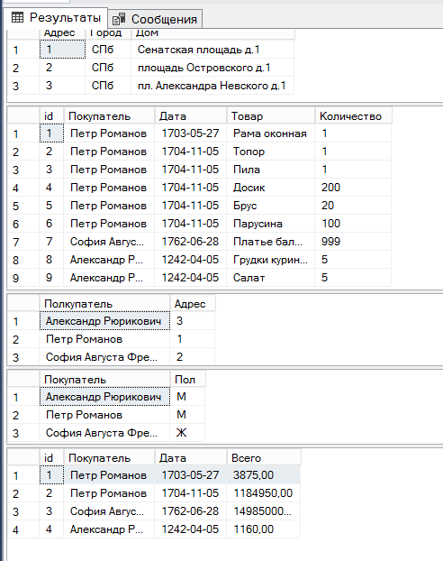
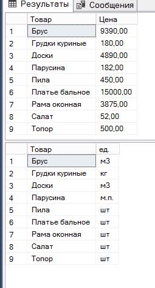

Таблица разделена на 7 таблиц:
1 - Адреса покупателей
2 - История покупок, где ID выступает в роли очереди
3 - Места проживания покупателей
4 - Пол покупателей
5 - Сумма, полученная за день с покупателя, id выступает в качестве дня активности кассы (можно было за главный ключ взять дату, но нет гарантий, что в один день два и более покупателей не сделают покупки)

6 - Цена каждого тавара в рублях (рубли можно было вынести в отдельную таблицу, но в таблице только рубли, так что это бессмысленно)
7 - Единицы измерения товара

[Код создания таблиц](second.sql)